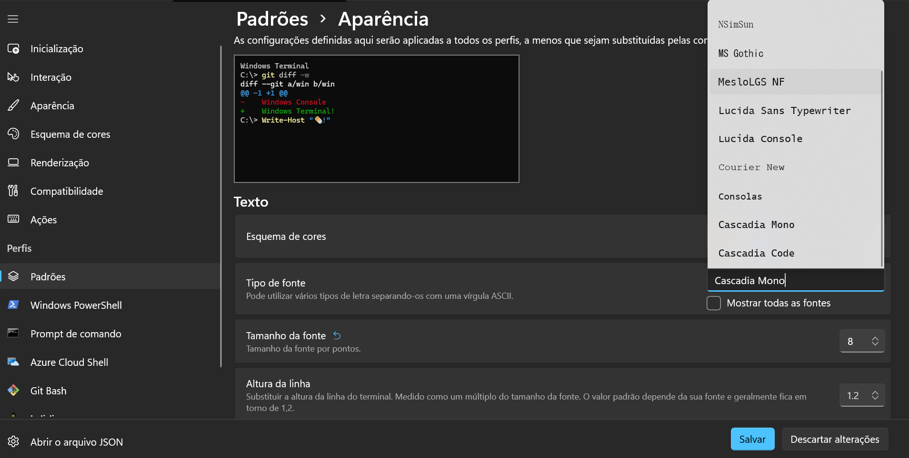

**# Cybersecurity**

# Configuração Automatizada do ZSH, Oh My ZSH e Plugins no WSL

Este repositório contém scripts para automatizar a instalação e configuração do Zsh, Oh My Zsh, fontes Powerline e plugins essenciais para uma experiência de terminal aprimorada no Windows Subsystem for Linux (WSL).

## Por Que ZSH e Oh My ZSH?

O Zsh (Z Shell) é um shell de linha de comando poderoso e altamente configurável, oferecendo recursos avançados de usabilidade, produtividade e customização em comparação com o Bash tradicional. O Oh My Zsh é um framework que facilita a gestão de configurações, temas e plugins para o Zsh, tornando a personalização ainda mais simples e eficaz.

## Visão Geral da Configuração

Nossa configuração incluirá:

1.  **Fontes Powerline (MesloLGS NF)**: Essenciais para exibir corretamente os ícones e símbolos especiais usados por temas e plugins, garantindo uma estética moderna e funcional.
2.  **ZSH**: O shell em si, com suas capacidades avançadas.
3.  **Oh My ZSH**: O framework para gerenciar o ZSH.
4.  **Zinit**: Um gerenciador de plugins leve e rápido.
5.  **Plugins essenciais**:
    * `fast-syntax-highlighting`: Realça os comandos digitados, indicando a sintaxe correta com cores.
    * `zsh-autosuggestions`: Sugere comandos com base no histórico, economizando tempo.
    * `zsh-completions`: Aprimora a funcionalidade de autocompletar, fornecendo informações úteis sobre os comandos.
6.  **Tema Powerlevel10k**: Um tema popular e altamente configurável que oferece um prompt visualmente rico e informativo.

## Como Utilizar

O processo é dividido em duas partes: uma configuração inicial no Windows e uma configuração principal no ambiente Linux do WSL.

### Parte 1: Configuração no Windows (Instalação das Fontes)

Este script (`windows_font_setup.bat`) irá baixar e instalar as fontes **MesloLGS NF**, que são cruciais para a exibição correta dos ícones e símbolos do seu novo terminal ZSH.

**Instruções:**

1.  Baixe o arquivo `windows_font_setup.bat` para o seu computador Windows.
2.  **Execute o script `windows_font_setup.bat` com permissões de administrador.** O script irá baixar e instalar as fontes para uma pasta temporária.
3.  **Configure o Windows Terminal:**
    * Abra o **Windows Terminal**.
    * Vá em `Configurações` (Ctrl + ,).
    * Em `Perfis`, selecione o seu perfil WSL (ex: Ubuntu).
    * Vá em `Aparência` e altere a opção `Fonte` para **"MesloLGS NF"**.
    * Clique em `Salvar`.



### Parte 2: Configuração no Linux (WSL)

Este script (`linux_zsh_setup.sh`) irá instalar o ZSH, Oh My ZSH, configurar o gerenciador de plugins `zinit`, instalar os plugins desejados e o tema Powerlevel10k.

**Instruções:**

1.  Abra seu terminal WSL (Ubuntu, por exemplo).
2.  Baixe o arquivo usando o seguinte comando:
    ```bash
    wget https://raw.githubusercontent.com/LKSFerreira/cybersecurity/main/linux_zsh_setup.sh
    ```
2.  Navegue até o diretório onde você salvou o script `linux_zsh_setup.sh`.
3.  Execute o script com o comando `bash`:
    ```bash
    bash ./linux_zsh_setup.sh
    ```
4.  O script fará a maior parte do trabalho. No final, ele irá iniciar o configurador interativo do Powerlevel10k (`p10k configure`). Siga as instruções na tela para personalizar seu tema.
5.  Após a conclusão do script e da configuração do Powerlevel10k, feche e reabra seu terminal WSL para que todas as mudanças sejam aplicadas.

**Observação sobre Cores:**
O script não altera o esquema de cores do Windows Terminal, pois isso é uma preferência pessoal e geralmente é feito na interface gráfica do Windows Terminal. Você pode ir em `Configurações` -> `Perfis` -> `[Seu Perfil WSL]` -> `Aparência` -> `Esquema de cores` para escolher um tema ou até mesmo editar o arquivo JSON de configurações para criar um esquema personalizado, conforme descrito no tutorial original.
